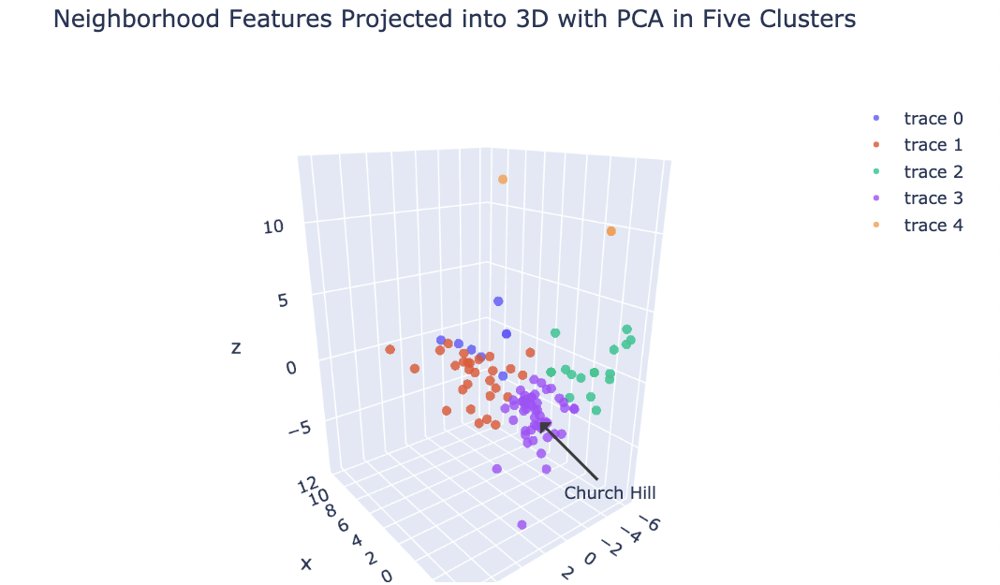

# Determining Retail Categories to Open in the Church Hill Neighborhood of Richmond, VA

For a better view of the jupyter notebook visit: https://nbviewer.jupyter.org/github/mphill82/Retail_Inference_Capstone/blob/a21be0e099fa35c9276b7e66748b49bcefdc0472/Retail_Inference_notebook.ipynb

## Introduction
The purpose of this project is to determine new retail that should open in the Church Hill neighborhood of Richmond, VA. We will compare Church Hill's retail offerings to those of similar neighborhoods in Richmond and other nearby cities. We can gather retail data on all the neighborhoods of Richmond and seven other nearby cities and make clusters of similar neighborhoods. We can then deduce the retail categories missing from Church Hill but found in high frequency within its cluster. These retail categories would likely do well in Church Hill because they've done well in neighborhoods we've deemed similar.
## Final Results
The following retail categories should open Church Hill because thet are missing and would likely do well according to my analysis.  View the jupyter notebook in the link above for more details.
1. Coffee shop
2. Hotel
3. Pizza place
4. Bar
5. Cafe
6. Italian Restaurant
7. Seafood Restaurant
8. Gym
9. Clothing store
10. Sushi restaurant
